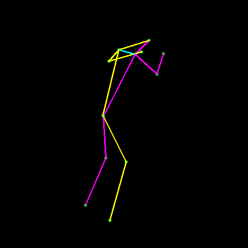
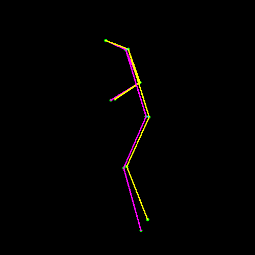
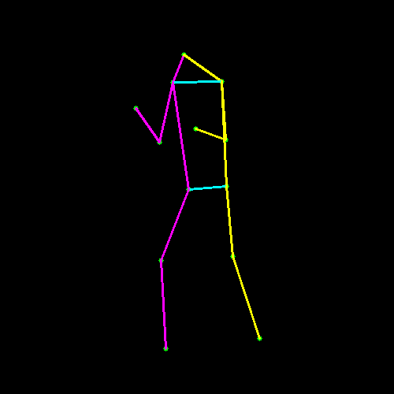
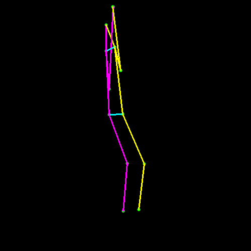

# Tennis shot recognition with Dense NN and RNN

YouTube video link : https://www.youtube.com/watch?v=CCqO5TXU7lc&ab_channel=antoinekeller

If you want the best from this repo, please go to the [RNN inference](#inference-on-a-tennis-video)

## Movenet

To download the movenet_lightning_f16 neural network from Tensorflow, run :

```
wget -q -O movenet.tflite https://tfhub.dev/google/lite-model/movenet/singlepose/lightning/tflite/float16/4?lite-format=tflite
```

Note that multiple variants can be found to https://www.tensorflow.org/hub/tutorials/movenet if you want a different trade-off between precision and inference speed.

## Dataset construction

### Download data

To get tennis videos, you can simply download them from any youtube converter, e.g. https://en1.onlinevideoconverter.pro/11/

### [extract_human_pose.py](extract_human_pose.py)

<p>
<em>Movenet human pose estimation</em></br>

</p>

### Tennis shot annotation

To make your annotation, you can use the [annotator.py](annotator.py) file, e.g

```
$ python annotator.py dataset/nadal/nadal.mp4 
```

and click your keyboard to mark the shots. This will output a csv file, named `annotation_something.csv` containing something like this:

```
Shot,FrameId
serve,257
forehand,294
backhand,329
forehand,374
forehand,415
backhand,450
```

where each line corresponds to a shot at a specified frame.

### Extract tennis shots as a succession of human poses (features)

```
$ python extract_shots_as_features.py dataset/nadal/nadal.mp4 annotation_nadal.csv shots/ --show
```

You might need to create the `shots/` directory before.

This will extract human poses from the video, and record them as tennis shots thanks to the previous annotation.
You will capture backhands, forehands, serves and neutral. Neutral is not a shot but this is a crucial thing to be able to detect that the player is not currently hitting the ball when we will do the training/inference.

We consider that a tennis shot lasts 30 frames (~1 second).

```
$ ls shots/
backhand_001.csv  forehand_001.csv  forehand_002.csv  forehand_003.csv  forehand_004.csv  neutral_001.csv  neutral_002.csv  neutral_003.csv  neutral_004.csv
```

```
$ head shots/forehand_001.csv 
nose_y,nose_x,left_shoulder_y,left_shoulder_x,right_shoulder_y,right_shoulder_x,left_elbow_y,left_elbow_x,right_elbow_y,right_elbow_x,left_wrist_y,left_wrist_x,right_wrist_y,right_wrist_x,left_hip_y,left_hip_x,right_hip_y,right_hip_x,left_knee_y,left_knee_x,right_knee_y,right_knee_x,left_ankle_y,left_ankle_x,right_ankle_y,right_ankle_x,shot
0.24768128,0.46133482,0.29127458,0.60832655,0.2986353,0.4901943,0.4634732,0.6036261,0.44121784,0.5008973,0.44362468,0.50294423,0.45565978,0.38690087,0.57719606,0.6352216,0.5762676,0.55509937,0.81709856,0.614062,0.78531176,0.49760842,0.9857921,0.6310805,0.97676635,0.5471711,forehand
0.25425464,0.4670041,0.30687225,0.620232,0.3046248,0.47319564,0.48155788,0.6236383,0.46894717,0.50145245,0.4852269,0.5189044,0.47714332,0.44624084,0.5741536,0.6381898,0.5711957,0.55343336,0.81873596,0.6066349,0.7932001,0.50778294,0.9810813,0.6331492,0.97467786,0.5662961,forehand
0.23021011,0.43812498,0.29137126,0.578389,0.29332063,0.45348772,0.46821362,0.6147487,0.43564284,0.4750053,0.48682898,0.50762904,0.4786701,0.42345053,0.5646003,0.6163307,0.5592214,0.5374307,0.82493514,0.5835469,0.7850982,0.49229804,0.98159647,0.60000414,0.95812225,0.5755893,forehand
0.2503711,0.4492255,0.3007083,0.6012328,0.29830006,0.45694143,0.47118282,0.62436926,0.34631574,0.3227784,0.4931431,0.5093735,0.35046908,0.23707509,0.5790796,0.6257565,0.5754603,0.5411513,0.84092164,0.5890928,0.807903,0.5128523,0.9835694,0.6176755,0.97084093,0.6150742,forehand
0.23161349,0.5323405,0.2941593,0.677908,0.29311097,0.5348006,0.46095178,0.71572244,0.338363,0.3806424,0.5346494,0.6266734,0.3597554,0.41269952,0.57938,0.70049256,0.57591766,0.62379444,0.84054255,0.6598259,0.82104295,0.62753606,0.98154694,0.70271015,0.96913123,0.7246554,forehand
0.2529632,0.49920836,0.30338925,0.6394149,0.30292368,0.49580964,0.47668132,0.67522943,0.35678822,0.38195962,0.5406949,0.578643,0.36700806,0.27765322,0.587195,0.6662972,0.5862619,0.58991826,0.8387587,0.6048145,0.83101994,0.599129,0.98500603,0.64449334,0.96306473,0.69741195,forehand
0.24535695,0.52636635,0.30026984,0.66903585,0.30256793,0.52024883,0.47605735,0.70131856,0.35872993,0.402304,0.56250036,0.61615676,0.3822818,0.29278523,0.5997218,0.68997717,0.5985583,0.63335794,0.837885,0.61363757,0.82360524,0.6430591,0.9902158,0.657898,0.9762623,0.7423976,forehand
0.24564868,0.5028289,0.3083542,0.6555314,0.30742472,0.51263857,0.48678944,0.6911687,0.37002572,0.39546648,0.57915074,0.6148324,0.40034997,0.28557548,0.60133183,0.6719014,0.59742635,0.62810564,0.83881956,0.59551847,0.82307833,0.6450304,0.98781514,0.6363827,0.9761761,0.74846315,forehand
0.2490067,0.5020019,0.3139781,0.6508378,0.30736688,0.51430833,0.48271784,0.67852145,0.3746984,0.4016965,0.5767192,0.6523305,0.40644142,0.30619377,0.59537584,0.6698034,0.5977311,0.62281454,0.83213735,0.58117926,0.8192987,0.64551955,0.98548204,0.61658233,0.9797259,0.75171655,forehand
```

You can visualize your results by running:

```
python visualize_features.py shots/forehand_001.csv
```

<p>
<em>Forehand example</em></br>

</p>

<p>
<em>Backhand example</em></br>

</p>

<p>
<em>Neutral/Idle example</em></br>

</p>

<p>
<em>Serve example</em></br>

</p>


## Training with a fully connected layers neural network

See [SingleFrameShotClassifier.ipynb](SingleFrameShotClassifier.ipynb)

In the notebook, we load our annotated datasets (csv files containing 1 second shot) with the position of each key points of the player pose. Each sample is here a set of features from a single frame (instantaneous). Possible classes are :
- backhand
- forehand
- neutral (or idle)
- serve

With a fully connected layers, we can reach a validation accuracy of ~80% (see also the confusion matrix).

And we export the neural network to *tennis_fully_connected.h5*

## Display raw results (ShotCounter.nb_history = 1)

```
python track_and_classify_frame_by_frame.py path/to/dimitrov_alcaraz.mp4 tennis_fully_connected.h5 
```

This will read the video of your choice, infer the movenet then feed it to your trained network at each frame. Probabilities of each class are displayed as vertical bars.

<p>
<em>Probabilities at each frame</em></br>

</p>

where classes are S(erve), B(ackhand), N(eutral) and F(orehand).

As you can see, classification is very unstable on a single frame.

## Use an averager and a basic shot counter

```
python track_and_classify_frame_by_frame.py path/to/dimitrov_alcaraz.mp4 tennis_fully_connected.h5 
```

Same priciple than before. But not we do an averaging of the shot probabilities over a sliding window of 10 frames. We add a basic shot counter to be able to detect (and not only classify) shots.

<p>
<em>Averaging and shot counter</em></br>

</p>

Proabilities are now smoother, and it s possible to have a decently working shot counter.

## Training with a RNN (Recurrent Neural Network)

See [RNNShotClassifier.ipynb](RNNShotClassifier.ipynb)

In the notebook, we load our annotated datasets (csv files containing 1 second shot) as a temporal sequence of the human pose. We then use keras GRU recurrent neural network to train it.

I get close to ~100% accuracy.

## Inference on a tennis video

<p>
<em>Probabilities with RNN</em></br>

</p>

It runs faster than real-time on my GPU.

```
python track_and_classify_with_rnn.py path/to/video.mp4 tennis_rnn.h5
```

You can append `--left-handed` if your player is left-handed.